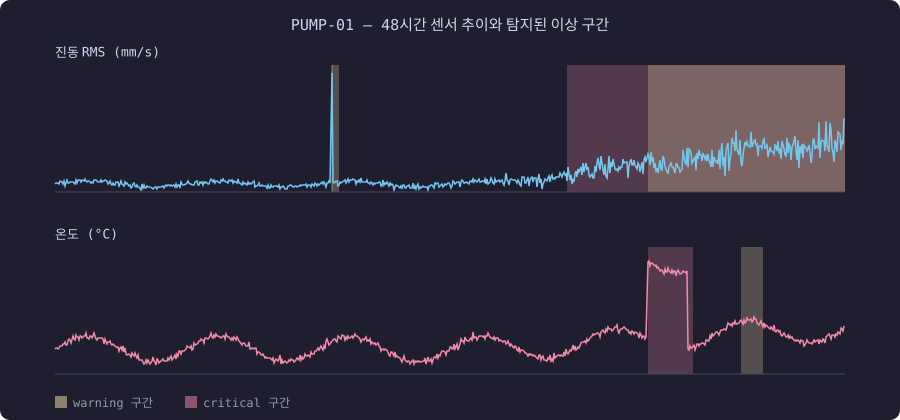

# 예지보전 진단 리포트 — PUMP-01

## 탐지된 이상 징후

| 심각도 | 센서 | 구간(분) | 탐지기 | 근거 |
|---|---|---|---|---|
| warning | vibration | 1007~1009 | zscore | z-score 최대 64.3 (임계 5.0) — 순간 스파이크 |
| warning | vibration | 1008~1032 | ewma | EWMA가 기준선(1.7) + 4.0σ 관리한계(2.1)를 24분간 초과 — 지속적 수준 이탈 |
| critical | vibration | 1866~2879 | ewma | EWMA가 기준선(1.7) + 4.0σ 관리한계(2.1)를 1013분간 초과 — 지속적 수준 이탈 |
| warning | vibration | 2160~2879 | trend | 최근 12시간 기울기 +0.119/시간 — 점진적 상승 추세, 한계치(7.1) 도달까지 약 29시간 (간이 RUL) |
| critical | temperature | 2163~2326 | ewma | EWMA가 기준선(56.3) + 4.0σ 관리한계(61.3)를 163분간 초과 — 지속적 수준 이탈 |
| warning | temperature | 2501~2580 | ewma | EWMA가 기준선(56.3) + 4.0σ 관리한계(61.3)를 79분간 초과 — 지속적 수준 이탈 |

## LLM 진단

[PUMP-01] / [베어링 마모/윤활 불량, 온도 상승] / [권고 조치: 정기 점검 및 윤활 재공급, 필요시 전문가 참조] 

진단 리포트:
설비 PUMP-01의 최근 1시간 평균 센서 데이터는 다음과 같습니다: 진동 RMS(진폭) 값이 4.06, 온도가 58.5입니다. 이상 탐지 결과에 따르면, 진동 지속적으로 증가하고 있으며, 이와 함께 온도도 상승 추세를 보이고 있습니다. 이러한 현상은 베어링 마모 또는 윤활 불량을 의심할 수 있습니다. 따라서 정기적인 점검 및 윤활 재공급이 필요하며, 필요시 전문가의 참조가 요구됩니다.
